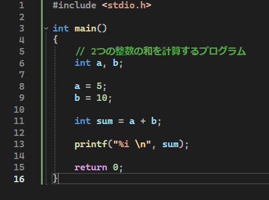
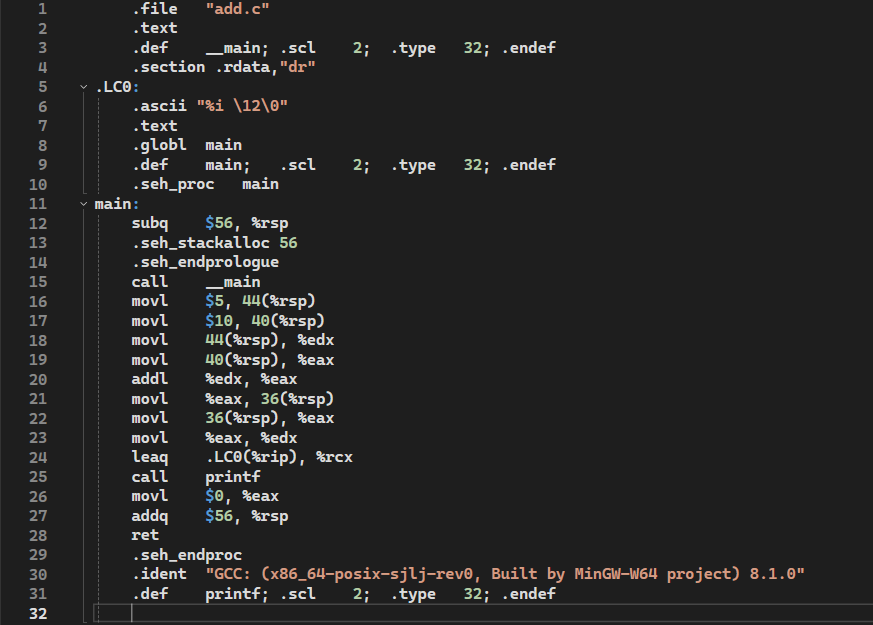
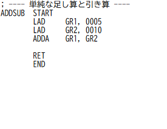
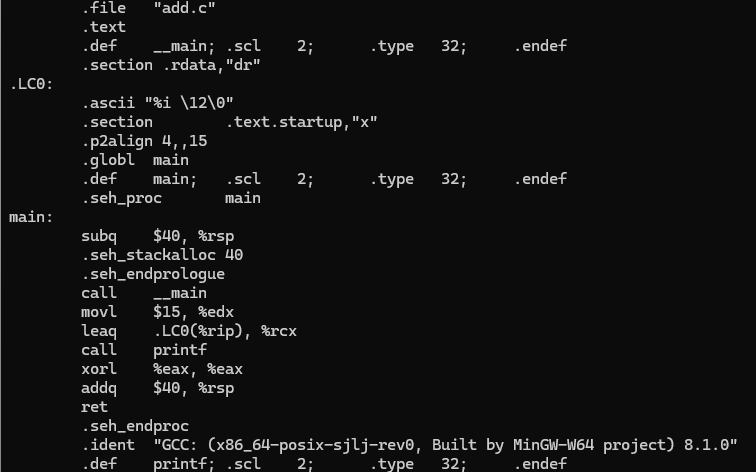

# C言語とx86-64アセンブリとCASL2(COMET2)

## 単純な加算でどのように処理が違うか比較

### C言語
  

### x86-64アセンブリ
  

### CASL2
  

## 見比べ
[C言語]  
int a,b;  
a = 5;  
b = 10;  
int sum = a + b;  
printf("%i \n", sum);  

[CASL2] 
LD GR1,0005 <- a = 5 
LD GR2,0010 <- b = 10 
ADDA GR1,GR2 <- GR1 = a+b  

C言語とCASL2では意味が見やすい  

C言語のソースファイルを[gcc -S -O0 -fno-pic -fomit-frame-pointer add.c]でコンパイルすると  
[x86-64]  
movl $5, 44(%rsp)  
movl $10, 40(%rsp)  
movl 44(%rsp), %edx  
movl 40(%rsp), %eax  
addl %edx, %eax  
movl %eax, 36(%rsp)  
レジスタが少ない/スタックを使って変数を置く  
printfなどはまた外部の話  
また、これは最適化されていないアセンブリコードである  

### 最適化したものとの比較
C言語のソースファイルを[gcc -S -O2 -fno-pic -fomit-frame-pointer add.c]でコンパイルすると  
  

最適化前  
call    __main  
movl    $5, 44(%rsp)  
movl    $10, 40(%rsp)  
movl    44(%rsp), %edx  
movl    40(%rsp), %eax  
addl    %edx, %eax  
movl    %eax, 36(%rsp)  
movl    36(%rsp), %eax  
movl    %eax, %edx  
leaq    .LC0(%rip), %rcx  
call    print  

最適化により、計算結果がコンパイル時に確定したため  
演算命令（addl）は削除されたが  
関数呼び出し規約に基づくスタック復帰処理（addq）は  
プログラムの正当性維持のため残ることを確認した。  
printf("%i \n",15);  
として凝縮された  

## 総括
gccの最適化オプション（-O0 / -O2）によって生成される
アセンブリを比較したところ、
定数計算や中間変数が最適化により消去され、
「計算手順」ではなく「意味だけが残る」ことを確認した。

これはCASL2が常に「人間が理解しやすい計算過程」を
明示的に記述する言語であるのに対し、
実在CPU向けアセンブリは
実行効率を最優先に意味を再構成する点で性質が異なると感じた。

もっと付け加えると  
CASL2では、関数呼び出し規約や
レジスタ割り当て戦略、
スタックフレーム管理といった概念は抽象化されている。

実在のアセンブリと比較することで、
CASL2は「CPUの計算モデルを理解するための言語」であり、
実機アセンブリは「システムと協調して動作するための言語」である
という役割の違いを理解できた。
